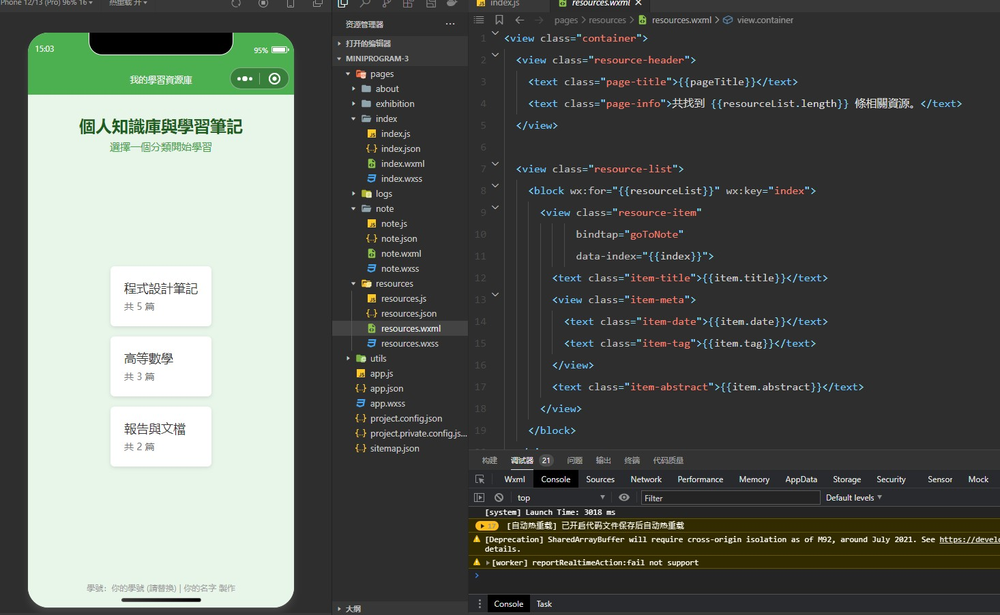
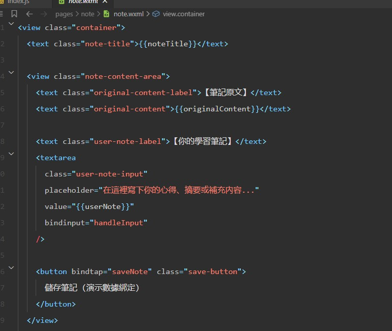
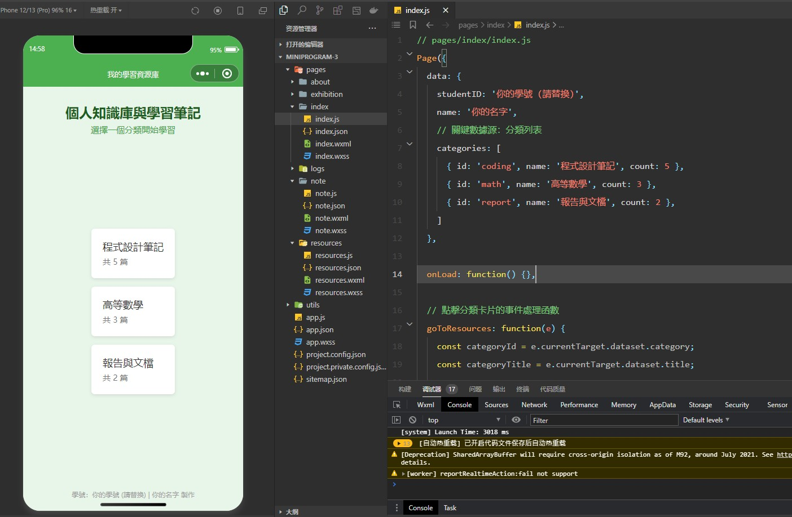
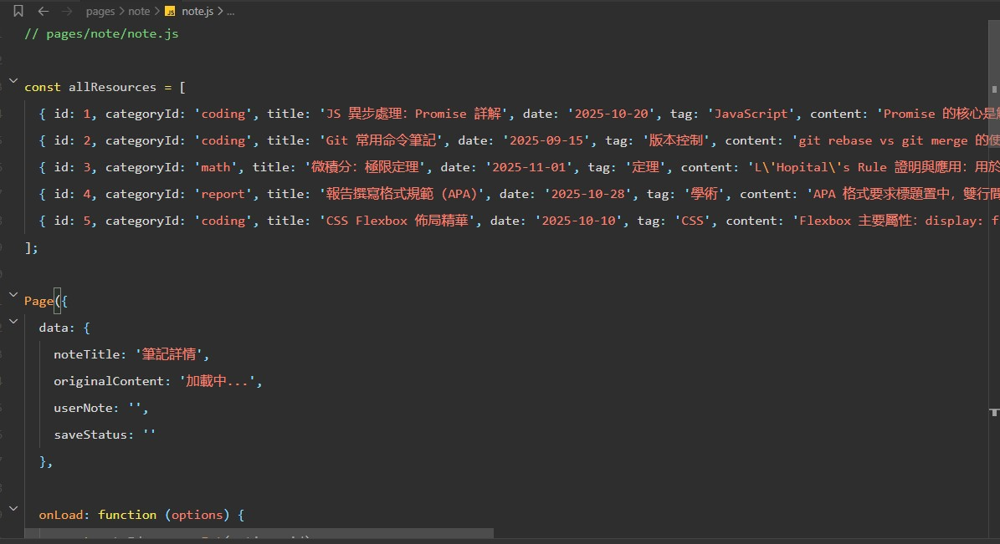
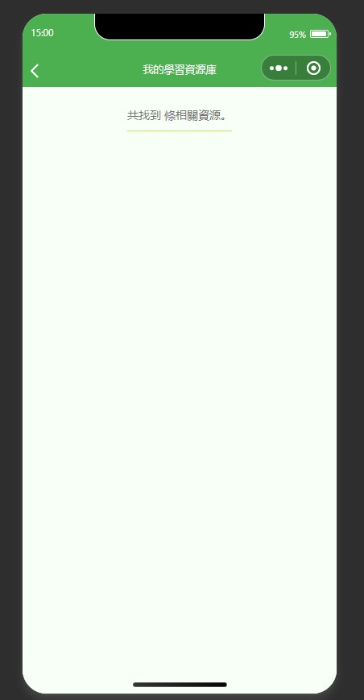
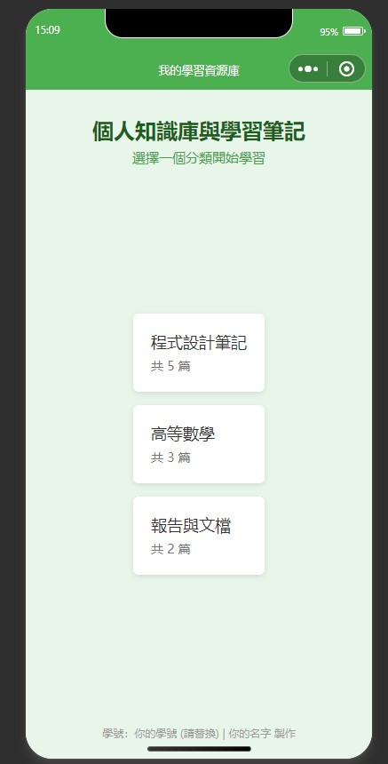

# -MIDTURN
# 📚 個人學習資源庫 (Mini Program Demo)

## 簡介

本專案是使用 **微信小程序 (Mini Program)** 實現的一個個人知識管理系統演示。

它模擬了學生整理、分類和記錄學習筆記的應用，旨在展示小程序在**多頁面架構**、**數據傳輸**和**本地數據儲存**上的能力。

## 核心功能

* **多頁面導航**：實現了首頁、資源列表、筆記詳情編輯頁三級頁面結構。
* 
* 
* **分類篩選**：使用者可以從首頁的分類卡片（如「程式設計」、「高等數學」）進入，自動篩選相關資源。
* 
* **筆記編輯與儲存**：提供專用的編輯區域，使用者可為每篇資源寫下心得，並利用小程序**本地緩存** (`wx.setStorageSync`) 進行數據保存。
* 
* **樣式**：採用簡潔綠色主題，界面易於閱讀。
* 

---

## 👨‍🎓 報告人資訊

* **學號**：`11224102 11224110 11324102`
* **姓名**：`王弘鈞 陳一昇 陳信宏`
